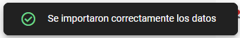

# Como Mostrar Datos desde Firebase Realtime Database en una Página Web

## ¿Cómo logramos integrar Firebase en un proyecto web?

### 1. **Abrir un Codespace en tu repositorio de GitHub:**
Lo primero que hay que hacer es abrir un **Codespace** desde tu repositorio de GitHub. Codespaces te permitirá tener un entorno de desarrollo en la nube sin tener que configurar nada localmente. 

### 2. **Instalar Nginx en el Codespace:**
Luego, hay que instalar dentro del Codespace **Nginx**, que es un servidor web ligero y muy rápido. Nginx te servirá para redirigir las peticiones y servir tu página HTML. Esto es muy útil porque con Nginx, puedes servir contenidos web sin complicaciones.

```sh
>> sudo apt update && upgrade
>> sudo apt install nginx
```

### 3. **Definir un `index.html` personalizado:**
   Después de instalar Nginx, tienes que definir tu archivo **index.html** personalizado. Este archivo HTML contiene todo el código necesario para mostrar los datos de Firebase, y además está preparado para conectar con la base de datos en tiempo real de Firebase a través de JavaScript.

#### 3.1 **¿Como personalizo el `index.html`?**
Para poder personalizar tu **index.html**, deberás dirigirte a la ruta de instalación del servidor Nginx en cuestión. La ruta predeterminada es **/var/www/html**. Dentro de esa ruta encontraras un único archivo que será el que editaremos con el comando **sudo nano index.html**.
De momento, solo le pondremos algo identificativo para diferenciar nuestra web de la predeterminada de Nginx.

Por ejemplo:
```html
<!DOCTYPE html>
<html lang="es">
    <head>
        <meta charset="UTF-8">
        <meta name="viewport" content="width=device-width, initial-scale=1.0">
        <title>Página de NGINX</title>
    </head>
    <body>
        <h1>Página de NGINX dentro de Codespace de 'alumno X'>"</h1>
    </body>
</html>
```

### 4. **Redirigir el puerto `80` y acceder al HTML modificado:**
Para poder hacer visible la web que hemos creado, tendremos que redirigir el puerto 80 de nuestro Codespace.  

Para redirigir el puerto `80`, tendremos que ir abajo del Codespace donde se indica en la imagen e ir al apartado de **"Puertos"**.  
   


En **"Puertos"**, simplemente le damos a *"Agregar puerto"*, escribimos `80` y le damos al **ENTER**.  

Como se ha visto en la imagen anterior, se nos genera una URL, la cual es donde podremos visualizar nuestra web.  

Si aparece un error de conexión o por el estilo, lo más probable es que nuestro servicio de *Nginx* se haya terminado/parado. La solución es simple, tenemos que volver a levantar/iniciar ese servicio de la siguiente forma:  

```sh
>> sudo service restart
```
O
```sh
>> sudo service start
```

Para que esa web la pueda ver cualquier persona desde Internet, deberás cambiar la visibilidad del puerto de *"Privada*" a *"Pública*" haciendo clic derecho encima del puerto  `80` y, tal como se muestra en la imagen, selecciona *"Visibilidad del puerto*" y ponla en "*Público*".


### 5. **Crear la Realtime Database en Firebase e importar la BBDD en JSON:**
A continuación, tendrás que acceder a tu **Realtime Database** en Firebase. Desde allí, subir el archivo **JSON** [BBDD_Completa.json](BBDD_Completa.json), que contiene las tablas de datos que queremos mostrar en la web. Esto es muy sencillo, ya que Firebase me permite subir el archivo directamente y automáticamente organiza los datos como nodos dentro de la base de datos NoSQL.

#### 5.1 **Crear el Proyecto**
Accede a la web de [Firebase](https://firebase.google.com/docs/database?hl=es) e inicia sesión con tu cuenta de Google en el apartado de *"Accede"*. <br>
Una vez iniciada la sesión iremos a *"Go to console"*.


Una vez en la consola de Firebase le daremos a *"Crear un proyecto"*, introduciremos un nombre para este. Cuando nos pregunte por Google Analitics, le daremos a que no, ya que en este caso de uso no nos hará ningún tipo de falta, y crearemos el proyecto.

#### 5.2 **Creación de la Realtime Database**
Cuando nuestro proyecto se haya creado correctamente, nos aparecerá la pantalla siguiente:


Iremos al menú de la izquierda y desplegaremos el apartado de *"Compilación"* y *"Realtime Database"*.


Dentro de la "Realtime Database" nos aparecerá un botón en medio de la pantalla reclamando que creemos una nueva BBDD.


Deberemos configurar de forma adecuada según nuestras preferencias.
En este caso, en el apartado de "Ubicació"n de la Realtime DB seleccionaré la zona horaria "Bélgica (europe-west1)", y para las "Reglas de seguridad" lo dejaremos en el modo de prueba.

Cuando hayamos creado la Realtime DB, ya estaremos preparados para poder importar el JSON de la BBDD (en este caso utilizaré el JSON de este proyecto: [BBDD_Completa.json](BBDD_Completa.json)).

#### 5.3 **Importar JSON a la Realtime Database**
Para importar el fichero JSON, iremos a los tres puntos situados dentro de la Realtime DB a la derecha. Nos saldrán varias opciones, pero seleccionaremos *"Import JSON"* y lo subiremos.


Si la importación se ha realizado correctamente, nos saldrá un popup arriba a la derecha como este:



Si da algún error, probablemente sea porque el JSON tiene alguna inconsistencia o el archivo no se formateó de forma correcta.

#### 5.4 **Crear app web dentro de nuestro proyecto**
Ahora que ya hemos importado el JSON correctamente, nos queda un paso más dentro de Firebase antes de empezar a mostrar los datos desde nuestra web.

Tendremos que volver a la *"Descripción General"*. En la pantalla principal, nos aparecerá lo siguiente:


La opción que en este caso nos interersa es la del icono web "</>".
Registramos la app con un nombre identificativo y le daremos a siguiente hasta volver a la *"Descripción General"*.

Iremos a *"Configuracion del proyecto"* y bajaremos hasta el apartado de *"Tus Apps"*.


No mostraré mi configuración, ya que cualquiera podría conectarse a la base de datos, pero necesitaremos saber estos parámetros para poder vincular nuestra Realtime DB a la web.


Ahora, con estos datos, podemos volver al Codespace para empezar a implementar Firebase en nuestra web.

### 6. **Instalar Firebase en el Codespace:**
Una vez de nuevo en nustro Codespace, instalaremos el **CLI y SDK de Firebase** en el proyecto para poder interactuar con la Realtime Database. Esto nos permitirá obtener los datos desde Firebase y mostrarlos dinámicamente en la página.

#### 6.1 **Instalar Firebase CLI y SDK**
Ejecuta el siguiente comando en la terminal para instalar Firebase CLI:
```sh
>> npm install -g firebase-tools firebase
```

#### 6.2 **Autenticarse en Firebase**
Para iniciar sesión en Firebase, usa el siguiente comando:
```sh
>> firebase login --no-localhost
```
Sigue los pasos indicados en pantalla para completar la autenticación.

#### 6.3 **Crea una Carpeta para el Proyecto**
Crea y accede a una carpeta donde se almacenará el proyecto de Firebase:
```sh
>> mkdir proyecto_firebase
>> cd proyecto_firebase
```

#### 6.4 **Inicializar Firebase**
Dentro de la carpeta del proyecto, ejecuta:
```sh
>> firebase init
```

Durante la instalación:
- Usa las flechas para desplazarte hasta Realtime Database.
- Selecciónala presionando espacio.
- Presiona Enter para continuar.

Cuando se te pregunte por el proyecto, selecciona Use existing project y elige tu proyecto de Firebase.
Si se solicita un archivo de seguridad, simplemente presiona Enter para seleccionar la opción predeterminada de Firebase.

Una vez finalizado este proceso, habremos instalado y configurado Firebase correctamente en nuestro Codespace.


### 7. **Modificar el `index.html` para obtener los datos de la Realtime Database:**
El último es modificar el archivo `index.html` con los parámetros necesarios para **conectar con Firebase** y obtener los datos. Usaremo el SDK de Firebase para hacer consultas a la base de datos y mostrar esos datos en diferentes **desplegables (selects)** en la página.

#### 7.1 **Dependencias de Realtime Database en HTML**
Para poder realizar la conexión desde el HTML a Firebase, necesitamos cargar los módulos SDK de Firebase.

```js
import { initializeApp } from "https://www.gstatic.com/firebasejs/9.6.1/firebase-app.js";
import { getDatabase, ref, get } from "https://www.gstatic.com/firebasejs/9.6.1/firebase-database.js";
```

#### 7.2 **Configuración, conexión e inicialización de Firebase**
Para conectar nuestra aplicación web con Firebase, debemos configurar las credenciales del proyecto y establecer la conexión con la Realtime Database.  

El siguiente código se encarga de:  
1. Definir la configuración de Firebase con las credenciales proporcionadas en la consola de Firebase.  
2. Inicializar la aplicación de Firebase con esa configuración.  
3. Obtener una instancia de la base de datos en tiempo real para interactuar con ella desde nuestra web.

```js
// Configuración de Firebase
const firebaseConfig = {
    apiKey: "TU_API_KEY",
    authDomain: "TU_AUTH_DOMAIN",
    databaseURL: "TU_BBDD_URL",
    projectId: "TU_PROJECT_ID",
    storageBucket: "TU_STORAGE_BUCKET",
    messagingSenderId: "TU_MESSAGING_SENDER_ID",
    appId: "TU_APP_ID"
};

// Inicializar Firebase
const app = initializeApp(firebaseConfig);
const database = getDatabase(app);
```

Asegúrate de reemplazar "TU_API_KEY", "TU_AUTH_DOMAIN", y los demás valores con los datos reales de tu proyecto en Firebase.
Esto permitirá que la aplicación acceda a la base de datos y pueda leer o escribir información en tiempo real.

#### 7.3 **Obtener los datos desde Realtime Database**
Esto simplemente es una plantilla personalizada en la cual he añadido manualmente (hardcoded) los nombres de las tablas de la base de datos.  
> ⚠️ **WARNING!!!** | Esta no es una buena práctica, por favor, no lo hagas en un proyecto real.   

```js
// Función para obtener datos desde Realtime Database
const getData = async (tableName, selectElement) => {
    try {
        const snapshot = await get(ref(database, tableName));
        if (!snapshot.exists()) {
            console.log(`No se encontraron datos en ${tableName}`);
            return;
        }

        const data = snapshot.val();

        selectElement.innerHTML = "";

        const option = document.createElement("option");
        option.textContent = `Selecciona un campo de ${tableName}`;
        selectElement.appendChild(option);

        for (const key in data) {
            if (data.hasOwnProperty(key)) {
                const option = document.createElement("option");
                option.textContent = `ID: ${key} - ${JSON.stringify(data[key])}`;
                selectElement.appendChild(option);
            }
        }
    } catch (error) {
        console.error("Error al obtener los datos de Realtime Database:", error);
    }
};

// Función que se ejecuta al cargar la página para mostrar los datos
window.onload = () => {
    const categoriaSelect = document.getElementById("categoria");
    const continenteSelect = document.getElementById("continente");
    const paisSelect = document.getElementById("pais");
    const productoSelect = document.getElementById("producto");
    const factsSelect = document.getElementById("facts");

    // Obtener datos para cada tabla
    getData("Categoria", categoriaSelect);
    getData("Continentes", continenteSelect);
    getData("Paises", paisSelect);
    getData("Productos", productoSelect);
    getData("Facts", factsSelect);
};
```

#### 7.4 **Mostrar los datos obtenidos en el HTML**
Y para terminar, tenemos que mostrar los datos del Realtime Database obtenidos de la siguiente forma:

```html
<h2>Selecciona una tabla:</h2>

<!-- Desplegables para cada tabla -->
<label for="categoria">Categorias:</label>
<select id="categoria"></select>
<br><br>

<label for="continente">Continentes:</label>
<select id="continente"></select>
<br><br>

<label for="pais">Paises:</label>
<select id="pais"></select>
<br><br>

<label for="producto">Productos:</label>
<select id="producto"></select>
<br><br>

<label for="facts">Facts:</label>
<select id="facts"></select>
```

### 8. **Resultado final**
Después de completar todos los pasos, nuestra web debería verse de la siguiente manera:


En esta interfaz, los datos de Firebase se cargan dinámicamente en los desplegables, permitiendo seleccionar y visualizar información en tiempo real desde la Realtime Database.

Si tu web no se ve como en la imagen o tienes errores al cargar los datos, revisa que la conexión con Firebase esté bien configurada y que la base de datos contenga la información correctamente importada.

### 9. **Resumen**
En este documento hemos cubierto todos los pasos necesarios para desplegar un entorno de desarrollo en la nube usando GitHub Codespaces y configurar un servidor con Nginx. Posteriormente, configuramos una Realtime Database en Firebase, importamos datos desde un archivo JSON y establecimos la conexión con nuestra aplicación web.

Finalmente, modificamos el index.html para que pueda obtener los datos desde Firebase y mostrarlos dinámicamente en la interfaz mediante desplegables.

Con esta implementación, logramos una aplicación funcional que interactúa con Firebase en tiempo real, permitiendo visualizar datos de forma sencilla y eficiente. A partir de aquí, podrías mejorar el proyecto agregando más funcionalidades, como filtros avanzados, autenticación de usuarios o un sistema de edición y eliminación de datos.

Si has seguido todos los pasos correctamente, ahora deberías tener tu aplicación web completamente funcional.

## Código HTML + JS para Mostrar los Datos de Firebase en Desplegables

Aquí dejo el código que utilicé para que puedas adaptarlo a tu propio proyecto:

```html
<!DOCTYPE html>
<html lang="es">
    <head>
        <meta charset="UTF-8">
        <meta name="viewport" content="width=device-width, initial-scale=1.0">
        <title>Mi Web con Firebase y CodeSpace</title>
        <!-- Cargar Firebase SDK como módulos -->
        <script type="module">
            import { initializeApp } from "https://www.gstatic.com/firebasejs/9.6.1/firebase-app.js";
            import { getDatabase, ref, get } from "https://www.gstatic.com/firebasejs/9.6.1/firebase-database.js";

            // Configuración de Firebase
            const firebaseConfig = {
                apiKey: "TU_API_KEY",
                authDomain: "TU_AUTH_DOMAIN",
                databaseURL: "TU_BBDD_URL",
                projectId: "TU_PROJECT_ID",
                storageBucket: "TU_STORAGE_BUCKET",
                messagingSenderId: "TU_MESSAGING_SENDER_ID",
                appId: "TU_APP_ID"
            };

            // Inicializar Firebase
            const app = initializeApp(firebaseConfig);
            const database = getDatabase(app);

            // Función para obtener datos desde Realtime Database
            const getData = async (tableName, selectElement) => {
                try {
                    const snapshot = await get(ref(database, tableName)); // Obtener datos del nodo
                    if (!snapshot.exists()) {
                        console.log(`No se encontraron datos en ${tableName}`);
                        return;
                    }

                    const data = snapshot.val();

                    // Limpiar select antes de agregar nuevas opciones
                    selectElement.innerHTML = "";

                    // Agregar un "option" vacío para la selección
                    const option = document.createElement("option");
                    option.textContent = `Selecciona un campo de ${tableName}`;
                    selectElement.appendChild(option);

                    // Iterar sobre los datos de la tabla y agregar las opciones al desplegable
                    for (const key in data) {
                        if (data.hasOwnProperty(key)) {
                            const option = document.createElement("option");
                            option.textContent = `ID: ${key} - ${JSON.stringify(data[key])}`;
                            selectElement.appendChild(option);
                        }
                    }
                } catch (error) {
                    console.error("Error al obtener los datos de Realtime Database:", error);
                }
            };

            // Función que se ejecuta al cargar la página para mostrar los datos
            window.onload = () => {
                const categoriaSelect = document.getElementById("categoria");
                const continenteSelect = document.getElementById("continente");
                const paisSelect = document.getElementById("pais");
                const productoSelect = document.getElementById("producto");
                const factsSelect = document.getElementById("facts");

                // Obtener datos para cada tabla
                getData("Categoria", categoriaSelect);
                getData("Continentes", continenteSelect);
                getData("Paises", paisSelect);
                getData("Productos", productoSelect);
                getData("Facts", factsSelect);
            };
        </script>
    </head>
    <body>
        <h1>Conexión con Firebase - Realtime Database</h1>

        <h2>Selecciona una tabla:</h2>

        <!-- Desplegables para cada tabla -->
        <label for="categoria">Categorias:</label>
        <select id="categoria"></select>
        <br><br>

        <label for="continente">Continentes:</label>
        <select id="continente"></select>
        <br><br>

        <label for="pais">Paises:</label>
        <select id="pais"></select>
        <br><br>

        <label for="producto">Productos:</label>
        <select id="producto"></select>
        <br><br>

        <label for="facts">Facts:</label>
        <select id="facts"></select>
    </body>
</html>
